# Лабораторная работа №1 — Автоматизация сборки 2D-игры через командную строку (CLI)

**Выполнил:** matiksiatik
**Репозиторий:** <https://github.com/matiksiatik/lr1-unity-build>
**Проект:** 2D Platformer Microgame (официальный шаблон Unity `com.unity.template.platformer` 5.0.7)
**Редактор:** Unity 6000.6.0f1 (Windows, модуль сборки WebGL)
**Целевая платформа сборки:** WebGL

## Цель работы

Изучить автоматическую сборку проекта Unity из командной строки (batch mode): подготовить скрипт-сборщик,
выполнить сборку WebGL без открытия графического редактора, проанализировать лог, проверить результат
локально и организовать процесс по схеме CI/CD с публикацией в GitHub (ветки, Pull Request, ревью).

## Окружение

| Компонент | Значение |
| --- | --- |
| ОС | Windows 10 Pro (x64) |
| Unity Editor | 6000.6.0f1 + модуль WebGL |
| Проект | `PlatformerMicrogame` |
| Основная сцена | `Assets/Scenes/SampleScene.unity` |

---

## Шаг 1. Инициализация проекта

Проект создан на базе официального шаблона **2D Platformer Microgame** — классического 2D-платформера
с готовыми сценами, скриптами, ассетами и обучающими материалами. Основная сцена игры
`Assets/Scenes/SampleScene.unity` добавлена и активна в настройках сборки проекта.

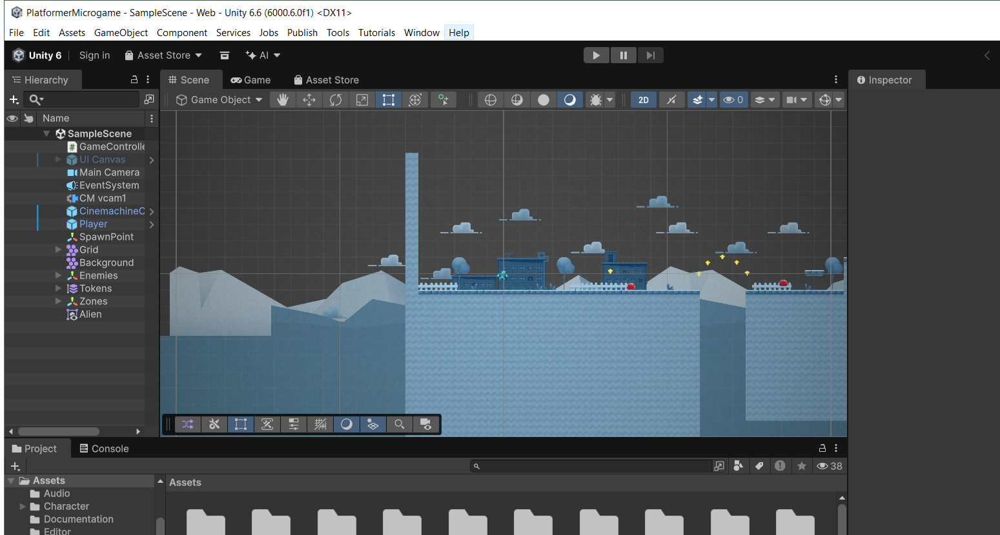

## Шаг 2. Создание C# скрипта сборщика

В проекте создана служебная папка `Assets/Editor`, в ней — скрипт
[`BuildManager.cs`](Assets/Editor/BuildManager.cs). Скрипт собирает список активных сцен,
запускает компиляцию проекта через `BuildPipeline.BuildPlayer()` и сообщает результат в лог.

Сцена присутствует в списке сборки (Build Profiles), платформа **Web** отмечена как активная:

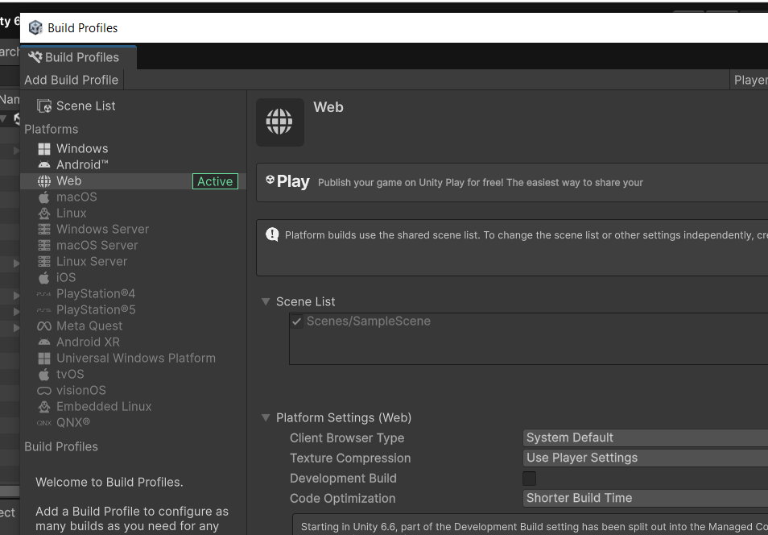

<details>
<summary>Листинг кода BuildManager.cs</summary>

```csharp
using System;
using UnityEditor;
using UnityEditor.Build.Reporting;
using UnityEngine;

public static class BuildManager
{
    // Путь для сохранения WebGL-версии игры
    private static readonly string WebGLBuildPath = "Builds/WebGL";

    /// <summary>
    /// Автоматический метод сборки игры под платформу WebGL
    /// (также доступен из меню редактора: Tools -> Build WebGL)
    /// </summary>
    [MenuItem("Tools/Build WebGL")]
    public static void BuildWebGL()
    {
        Debug.Log("[CI/CD] Запущен автоматический процесс сборки WebGL...");

        // 1. Получаем список сцен, включенных в настройки проекта (Build Settings)
        string[] levels = GetScenes();

        if (levels.Length == 0)
        {
            Debug.LogError("[CI/CD] Ошибка: В Настройках Сборки (Build Settings) не найдено ни одной активной сцены!");
            ExitWithCode(1);
            return;
        }

        // 2. Конфигурируем параметры сборки
        BuildPlayerOptions buildPlayerOptions = new BuildPlayerOptions
        {
            scenes = levels,
            locationPathName = WebGLBuildPath,
            target = BuildTarget.WebGL,
            options = BuildOptions.None // Для отладочной сборки можно использовать BuildOptions.Development
        };

        // 3. Запускаем компиляцию
        BuildReport report = BuildPipeline.BuildPlayer(buildPlayerOptions);
        BuildSummary summary = report.summary;

        // 4. Анализируем результаты
        if (summary.result == BuildResult.Succeeded)
        {
            Debug.Log($"[CI/CD] УСПЕХ! WebGL билд успешно создан.");
            Debug.Log($"[CI/CD] Время сборки: {summary.totalTime.TotalSeconds:F2} сек. Размер: {summary.totalSize} байт.");
            ExitWithCode(0);
        }
        else
        {
            Debug.LogError($"[CI/CD] ОШИБКА СБОРКИ! Количество ошибок: {summary.totalErrors}");
            ExitWithCode(1);
        }
    }

    /// <summary>
    /// Вспомогательный метод для сбора всех активных сцен из проекта
    /// </summary>
    private static string[] GetScenes()
    {
        var editorScenes = EditorBuildSettings.scenes;

        // Считаем только те сцены, у которых стоит галочка "активна"
        int activeCount = 0;
        foreach (var scene in editorScenes)
        {
            if (scene.enabled) activeCount++;
        }

        string[] scenePaths = new string[activeCount];
        int index = 0;
        foreach (var scene in editorScenes)
        {
            if (scene.enabled)
            {
                scenePaths[index] = scene.path;
                index++;
            }
        }

        return scenePaths;
    }

    /// <summary>
    /// Корректное завершение процесса Unity в зависимости от режима запуска
    /// </summary>
    private static void ExitWithCode(int code)
    {
        // Если Unity запущена в batchmode (из консоли) — принудительно закрываем редактор с кодом возврата
        if (Environment.CommandLine.Contains("-batchmode"))
        {
            EditorApplication.Exit(code);
        }
    }
}
```

</details>

Файл скрипта в репозитории GitHub (ветка LR1):

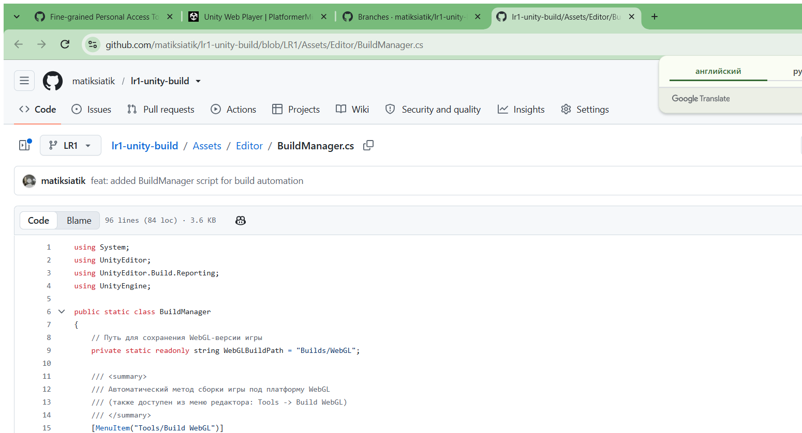

## Шаг 3. Отключение сжатия WebGL

Для локального запуска собранной игры (через локальный веб-сервер, без настройки HTTP-заголовков)
в настройках **Edit → Project Settings → Player → WebGL → Publishing Settings** установлен
**Compression Format = Disabled**.

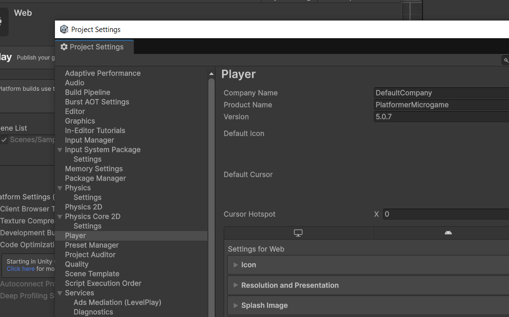

Значение зафиксировано в настройках проекта: `ProjectSettings.asset → webGLCompressionFormat: 2 (Disabled)`.

## Шаг 4. Проверка скрипта через интерфейс Unity

Скрипт компилируется без ошибок. Для появления пункта в верхнем меню редактора в код добавлен
атрибут `[MenuItem("Tools/Build WebGL")]` (в листинге методички он опущен, однако меню Unity
не генерируется для статических методов автоматически — это работает только при наличии атрибута).
Теперь сборку можно запустить и вручную: **Tools → Build WebGL**.

## Шаг 5. Локальная сборка через терминал (CLI)

Проект полностью закрыт в редакторе. Из корневой папки проекта выполнена команда:

```powershell
& "C:\Program Files\Unity\Hub\Editor\6000.6.0f1\Editor\Unity.exe" -batchmode -nographics -executeMethod BuildManager.BuildWebGL -quit -logFile build_webgl.log
```

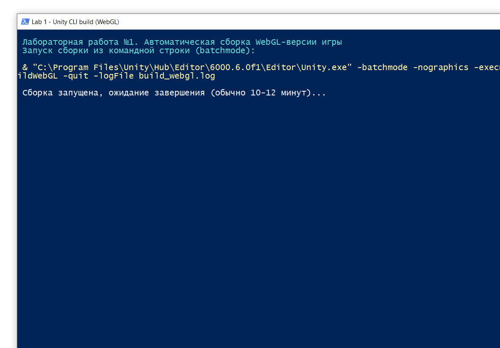

Используемые флаги:

| Флаг | Назначение |
| --- | --- |
| `-batchmode` | запуск Unity в фоновом режиме, без окон редактора |
| `-nographics` | без инициализации графического движка (для серверов сборки) |
| `-executeMethod BuildManager.BuildWebGL` | выполнить статический метод сборки сразу после открытия проекта |
| `-quit` | закрыть Unity после завершения метода |
| `-logFile build_webgl.log` | перенаправить лог Unity в файл |

## Шаг 6. Анализ результатов и логов сборки

В корне проекта создан файл `build_webgl.log`. Ключевые строки в конце лога:

```
[CI/CD] Запущен автоматический процесс сборки WebGL...
[CI/CD] УСПЕХ! WebGL билд успешно создан.
[CI/CD] Время сборки: 108,58 сек. Размер: 58108393 байт.
```

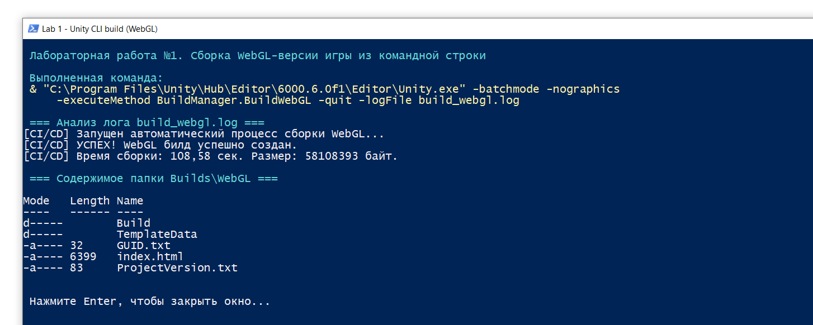

Скомпилированные файлы игры появились в папке `Builds/WebGL/`:

- `index.html` — стартовая страница игры;
- `Build/` — `WebGL.data`, `WebGL.wasm`, `WebGL.framework.js`, `WebGL.loader.js`;
- `TemplateData/` — ресурсы шаблона страницы;
- `GUID.txt`, `ProjectVersion.txt`.

## Шаг 7. Проверка работоспособности (локальный запуск)

Двойной клик по `index.html` не работает из-за политик безопасности браузеров (CORS), поэтому
папка сборки запущена через локальный статический веб-сервер (аналог расширения Live Server).
Игра успешно загрузилась: главный экран микроигры отображается, персонаж управляется с клавиатуры.

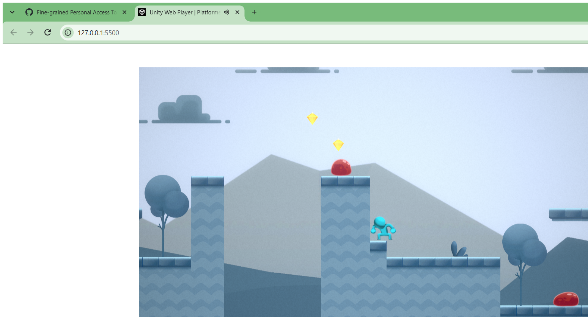

## Шаг 8. Настройка Git и публикация

Создан файл `.gitignore` (содержимое — по методичке; добавлена строка `*.slnx` для служебных
solution-файлов Unity 6):

```gitignore
[L|l]ibrary/
[Tt]emp/
[Oo]bj/
[L|l]ogs/
[U|u]sers/
[B|b]uild/
[B|b]uilds/
[Uu]ser[Ss]ettings/
[Pp]roject[Ss]ettings/ProjectVersion.txt
*.cs.md
*.csproj
*.unityproj
*.sln
*.suo
*.user
*.userprefs
*.pidb
*.booproj
*.svd
*.pdb
*.opendb
*.VC.db
build_webgl.log
*.slnx
```

> Каталог `Builds/` и файл `build_webgl.log` исключены из репозитория: результаты сборки
> воспроизводятся командой из Шага 5.

История коммитов:

```bash
git init
git branch -M main
git add .
git commit -m "chore: initializing a 2D Platformer Microgame project"   # чистый шаблон без скрипта сборщика

git checkout -b LR1
git add Assets/Editor/BuildManager.cs
git commit -m "feat: added BuildManager script for build automation"

git add README.md
git commit -m "docs: Lab report #1 added"

git remote add origin https://github.com/matiksiatik/lr1-unity-build.git
git push -u origin main
git push -u origin LR1
```

Ветки `main` и `LR1` в репозитории:

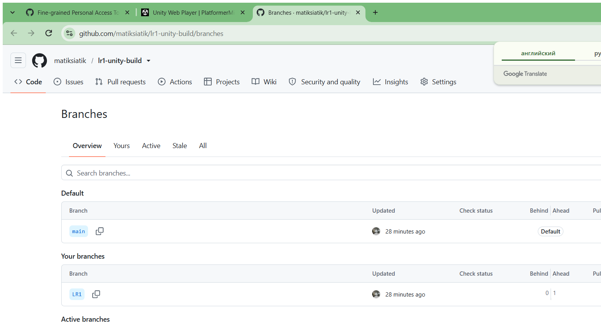

## Шаг 9. Pull Request и Peer Review

Создан Pull Request **LR1 → main** (base: `main`, compare: `LR1`). После этого к PR добавляются
ревьюеры-одногруппники: они проверяют код скрипта и отчёт во вкладке Files Changed, оставляют
комментарии и аппрувы, после чего выполняется слияние ветки в `main`.

**Pull Request #1:** <https://github.com/matiksiatik/lr1-unity-build/pull/1>

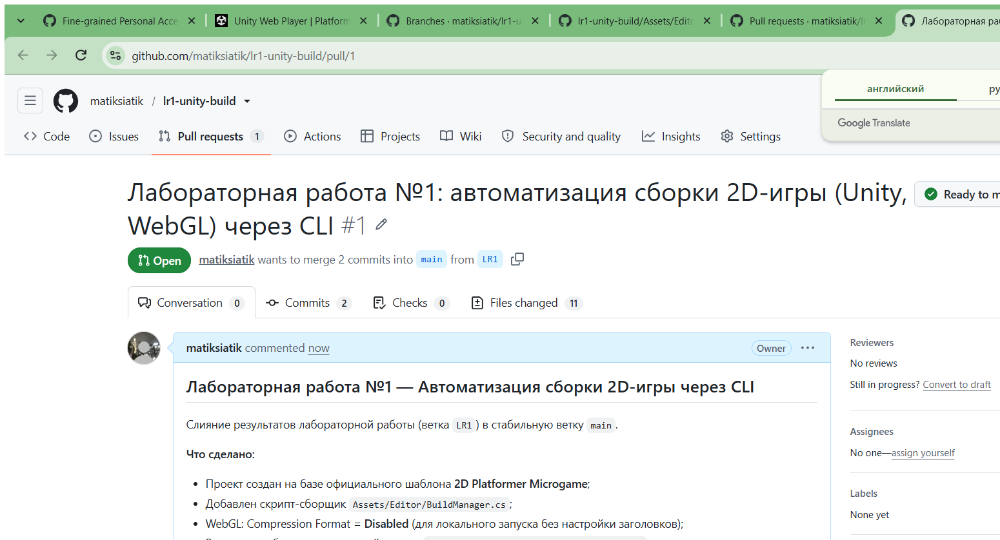

---

## Вывод

В ходе лабораторной работы освоена автоматическая сборка проекта Unity из командной строки
в batch-режиме: подготовлен скрипт-сборщик `BuildManager.cs`, настроена платформа WebGL
(со отключённым сжатием для локального запуска), выполнена сборка без открытия редактора
с анализом лога и проверкой артефактов. Результат проверен локально через веб-сервер.
Также отработан процесс CI/CD-подобного воркфлоу в Git: ветки `main`/`LR1`, отдельные
логические коммиты, публикация на GitHub и подготовка Pull Request с ревью.

---

# Лабораторная работа №2 — Настройка репозиториев на GitHub и базовая автоматическая проверка проекта (Sanity Check)

**Выполнил:** matiksiatik
**Основной репозиторий:** <https://github.com/matiksiatik/lr1-unity-build>
**Резервный репозиторий:** <https://github.com/matiksiatik/lr1-unity-build-backup>

## Цель работы

Изучение принципов построения декларативных сценариев непрерывной интеграции (CI) на платформе GitHub Actions: автоматизация верификации структуры проекта (Sanity Check), безопасное управление секретами репозитория и настройка автоматического зеркалирования исходного кода в резервную инфраструктуру.

## Выполненные шаги

1. **Создан резервный репозиторий** `lr1-unity-build-backup` (пустой, без README и .gitignore) — приёмник для зеркалирования.
2. **Сгенерирован Personal Access Token (classic)** с правами `repo` и `workflow`.
3. **Токен сохранён в секретах репозитория** `lr1-unity-build`: Settings → Secrets and variables → Actions → `BACKUP_TOKEN` (значение не попадает в исходный код).
4. **Добавлен файл пайплайна** [`.github/workflows/main.yml`](.github/workflows/main.yml) с двумя задачами:
   - `sanity_check` — проверка структуры проекта (наличие ключевых папок и файлов: `Assets`, `Assets/Editor/BuildManager.cs`, `Assets/Scenes/SampleScene.unity`, `ProjectSettings/ProjectSettings.asset`, `Packages/manifest.json`, `README.md`, `.gitignore`, `.github/workflows/main.yml`);
   - `mirror_repo` — зеркалирование репозитория в резервный: полное копирование всех ветвей и истории коммитов (`fetch-depth: 0` + `git push --mirror`); запускается только после успешного `sanity_check` (директива `needs`).
5. **Изменения отправлены в ветку `LR2`**, создан Pull Request → смёржен в `main`.
6. **Проверка результатов:** в разделе Actions запуски завершились успешно (зелёные галочки `sanity_check` и `mirror_repo`); резервный репозиторий автоматически наполнен ветвями и полной историей коммитов.


## Скриншоты выполнения

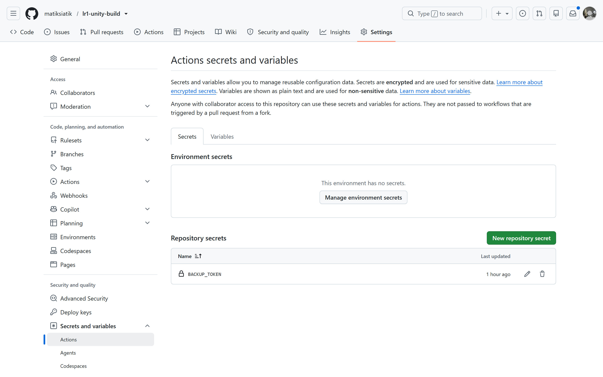

*Рис. 1. Токен сохранён в секретах репозитория: Settings → Secrets and variables → Actions → `BACKUP_TOKEN`.*

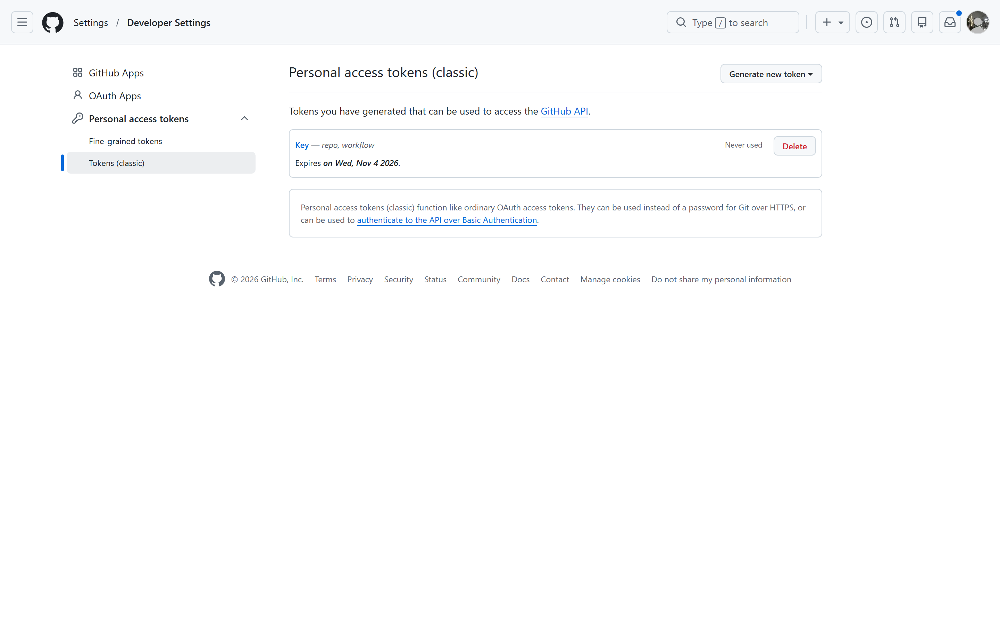

*Рис. 2. Personal Access Token (classic) с правами `repo` и `workflow`.*

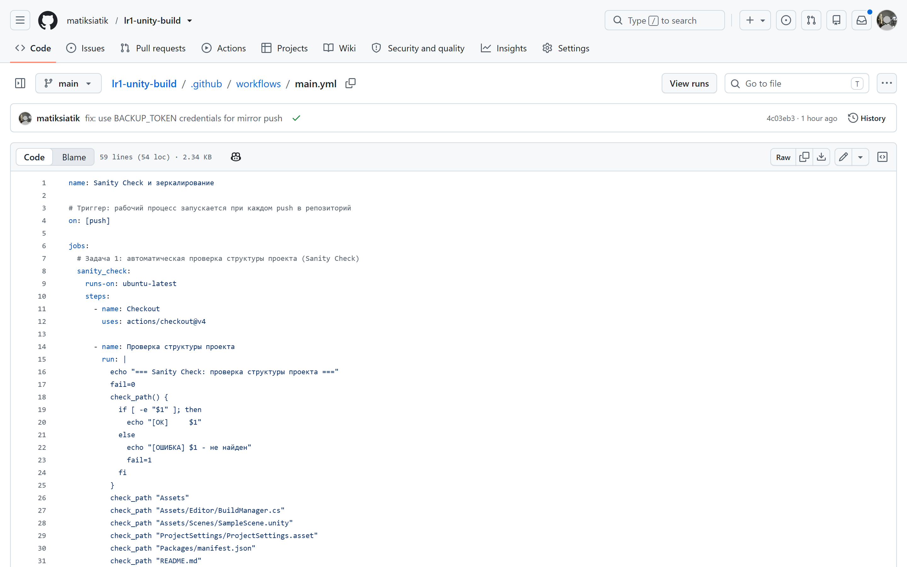

*Рис. 3. Файл пайплайна `.github/workflows/main.yml` (задачи `sanity_check` и `mirror_repo`).*

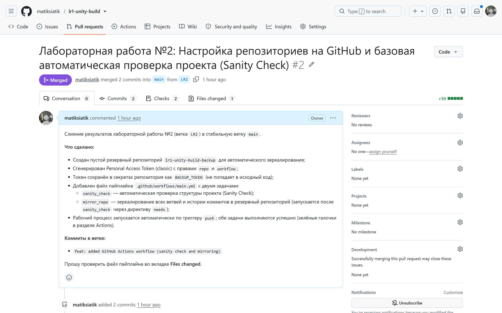

*Рис. 4. Изменения отправлены в ветку `LR2`, Pull Request смёржен в `main`.*

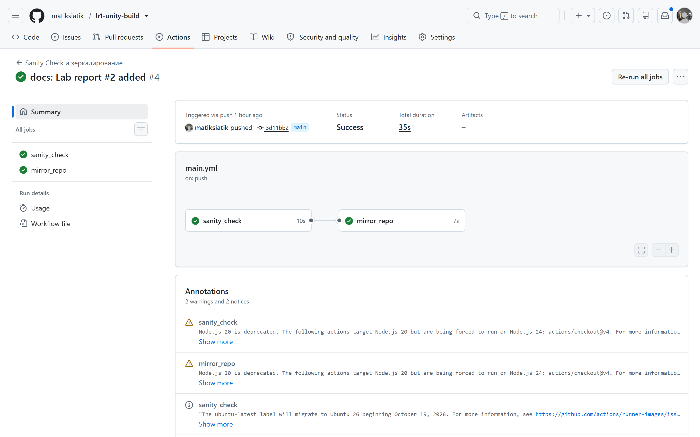

*Рис. 5. Раздел Actions: обе задачи завершились успешно (зелёные галочки).*

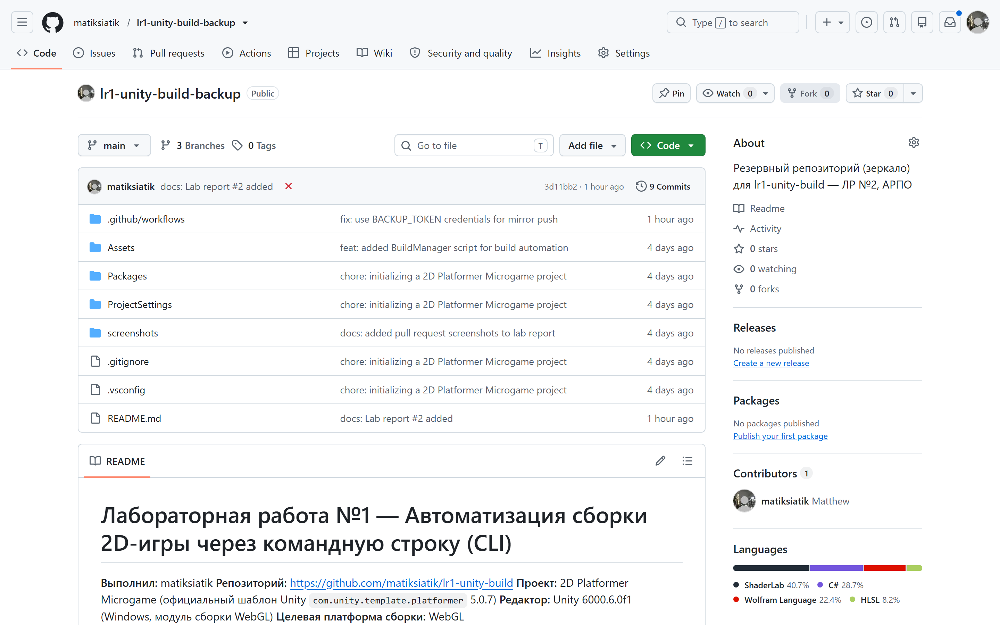

*Рис. 6. Резервный репозиторий `lr1-unity-build-backup` автоматически наполнен.*

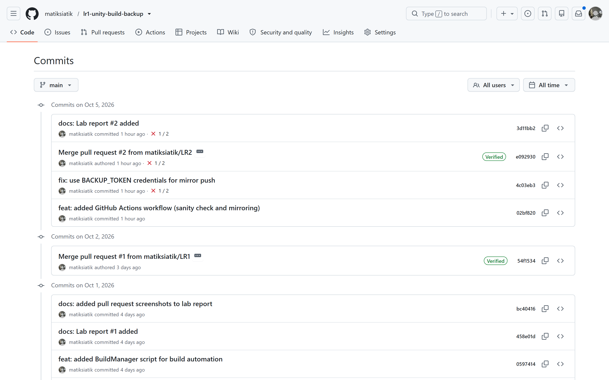

*Рис. 7. В резервном репозитории скопированы все ветки и полная история коммитов.*

